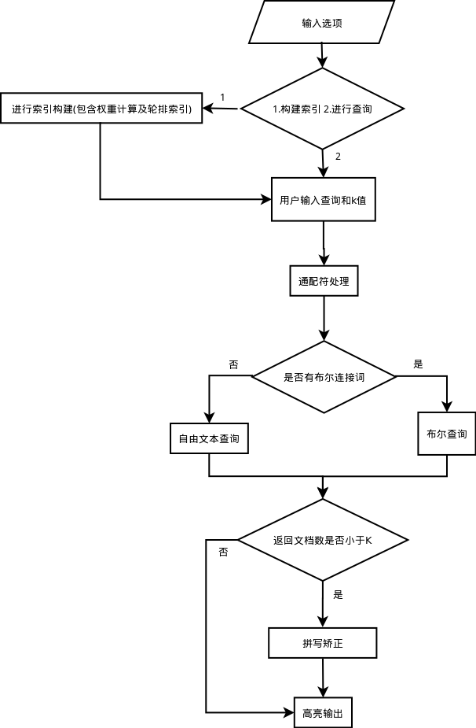

# Information_Retrieval_Tool

1.实现倒排索引以及向量空间模型，支持评分、排序、Top K查询、布尔查询、短语查询、拼写矫正(必须要实现的功能)。

2.分小组完成，每组4人，分组情况见下（如有疑问，请及时致信smile123000@zju.edu.cn）。

3.推荐添加功能及加分项，最终将按照添加功能的强弱适当加分（如同义词查询，索引压缩、通配符查询等本课程提到的知识点）。

4.使用C/C++或Java/python编程，不要求图形化界面（控制台程序，也就是小黑窗就行）。

5.不能直接调用有检索功能的第三方库（如Lucene等）。

6.对索引的文档集没有要求，但是程序展示时，须索引推荐语料库。点击下载推荐语料库

7.组内成员得分相同，希望大家能均匀分工，合力完成。

8.写一个文档说明，写明实现了哪些功能，并如何使用程序进行操作。

## 索引部分
- python模块:`src/indexing.py`  
    - 实现查询的同学**可能**使用的函数:
        1. `get_term_list(text)`:  
        将文本字符串转换成词形归并的后term_list
        2. `terms2term_pos(terms,stopwords)`:  
        将term_list去除停用词并转换成以term为key,位置列表为value的字典  
    - 计算权重的同学**可能**使用的函数：
        1. `get_docids(directory）`：
        输入要遍历的目录名，用于获取docid的list
        2. `dumpfile(pyobject,filename)`:
        将计算好权重的index持久化存储起来，请使用和原数据不同的文件名，如`pyobjects/weighted_index.pickle`
- pickle文件:
    1. `pyobjects/index.pickle`是没有去除停用词的版本
    2. `pyobjects/index_no_stopwords.pickle`是去除了停用词的版本  
    读入方法(**假设现在在src目录下**):
    ```python3
    import pickle
    with open('../pyobjects/index_no_stopwords.pickle', 'rb') as pickfile:
        inv_dict = pickle.load(pickfile)
    ```
- 索引的结构:
    1. 三层字典，最外层是以term(type: str)为key，第二层是以docid(type: int)为key,第三层的key是数据的名字(目前只有三种可能：'title_pos'，'body_pos','weight'),然后'title_pos'和'body_pos'对应的值都是一个list(int)  
    2. 诸如这样的用法：取love这个词在docid为2的文档的title中出现的位置: `inv_dict['love'][2]['title_pos']`  
    存储love这个词在docid为2的文档的weight为1.8:`inv_dict['love'][2]['weight']=1.8`
## 查询流程图

## DDL
22/06/2017
